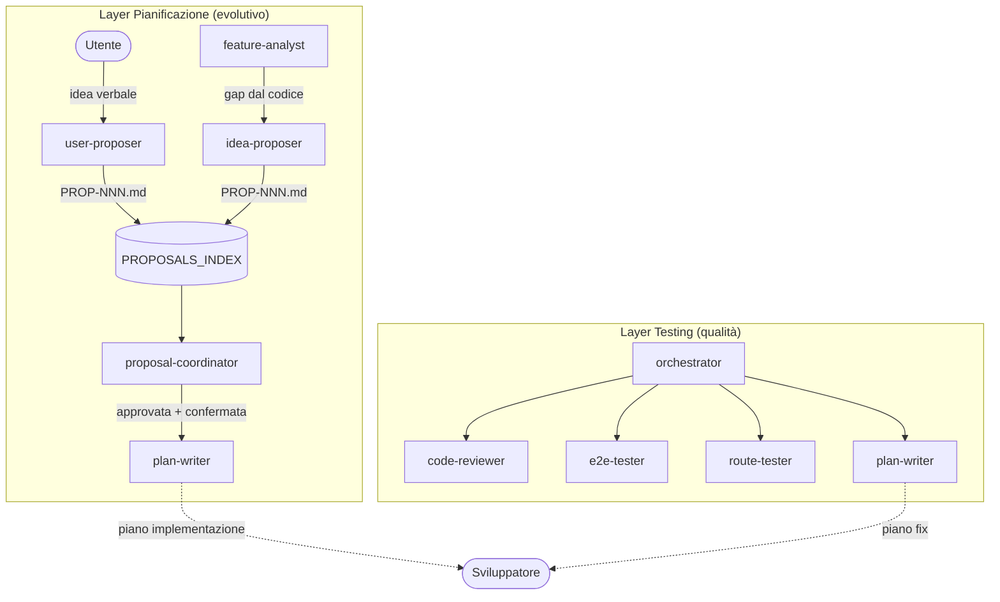
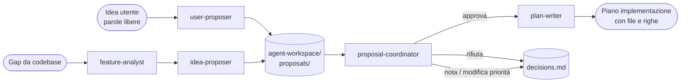
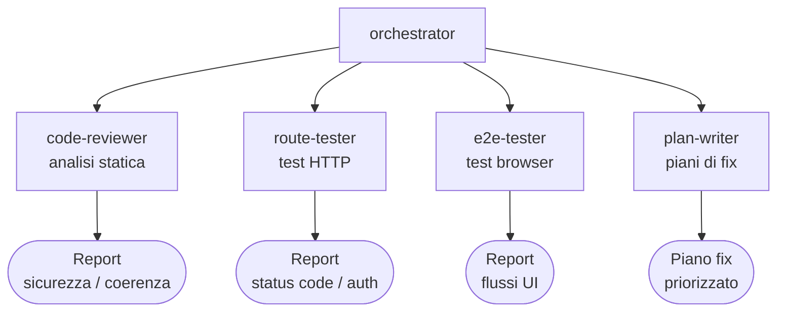

# Sistema Multi-Agente OCHEM

Documentazione dell'architettura degli agenti AI disponibili per lo sviluppo e la manutenzione di OCHEM.
Gli agenti sono definiti in `.claude/agents/` e si invocano tramite Claude Code.

---

## Architettura Generale



---

## Layer Pianificazione

Gestisce il ciclo di vita delle proposte di nuove funzionalità e fix.



### Agenti del layer

| Agente | Input | Output | Scrive file? |
|--------|-------|--------|-------------|
| `feature-analyst` | Codebase OCHEM | `feature-inventory.md` con gap | Sì |
| `idea-proposer` | Gap da inventario | `PROP-NNN.md` strutturata | Sì |
| `user-proposer` | Idea verbale utente | `PROP-NNN.md` strutturata | Sì |
| `proposal-coordinator` | Proposte in `agent-workspace/` | Decisioni, aggiornamento stato, avvio plan-writer | Sì |
| `plan-writer` | Proposta approvata o lista bug | Piano dettagliato con file/righe/ordine | No (output in chat) |

### Flusso raccomandato

**Nuova sessione di analisi:**
```
1. feature-analyst   → produce feature-inventory.md
2. idea-proposer     → genera PROP-001..N dai gap critici
3. proposal-coordinator → revisione interattiva
```

**Proposta dell'utente:**
```
1. user-proposer     → "Voglio che i lab ricevano una notifica quando..."
2. proposal-coordinator → revisione e approvazione
3. plan-writer       → piano di implementazione
```

**Solo revisione proposte esistenti:**
```
proposal-coordinator → mostrami le proposte P1 in attesa
```

---

## Layer Testing

Verifica la qualità del codice esistente: analisi statica, test HTTP, test E2E.



### Agenti del layer

| Agente | Quando usarlo | Prerequisiti |
|--------|---------------|--------------|
| `orchestrator` | Sessione completa di analisi | Nessuno |
| `code-reviewer` | Prima di un commit, analisi mirata | Nessuno |
| `route-tester` | Verifica rapida autorizzazioni e status code | Python + venv attivo |
| `e2e-tester` | Test UI completi su flussi utente | Server Flask su `:5000` |
| `plan-writer` | Dopo aver trovato bug, pianificazione fix | Lista bug/feature in input |

### Flusso raccomandato

**Sessione completa (raccomandato):**
```
Usa l'orchestrator per avviare una sessione completa di analisi
```

**Solo code review:**
```
Usa il code-reviewer per analizzare routes_cycles.py e routes_dati.py
```

**Solo test HTTP:**
```
Usa il route-tester per verificare le route admin
```

---

## Come invocare gli agenti

Gli agenti si invocano in linguaggio naturale dentro Claude Code:

```
Usa user-proposer — "Vorrei aggiungere un export Excel dei risultati"
Usa feature-analyst per aggiornare l'inventario
Usa idea-proposer per generare proposte per tutti i gap critici
Usa il proposal-coordinator — mostrami le proposte P1
Usa il code-reviewer per analizzare i file modificati nell'ultimo commit
Usa l'orchestrator per avviare una sessione completa di analisi
```

---

## Workspace e file prodotti

```
agent-workspace/
├── feature-inventory.md        ← prodotto da feature-analyst
├── PROPOSALS_INDEX.md          ← indice di tutte le proposte
├── decisions.md                ← log decisioni del proposal-coordinator
└── proposals/
    ├── PROP-001-titolo.md      ← origin: gap-analysis (da idea-proposer)
    ├── PROP-002-titolo.md
    └── PROP-NNN-titolo.md      ← origin: user (da user-proposer)
```

I file in `agent-workspace/` sono versionati in git e rappresentano lo stato del backlog di sviluppo.

---

## Regole generali

- `feature-analyst`, `idea-proposer`, `user-proposer`, `code-reviewer`, `route-tester` → **sola lettura** sul codice
- `proposal-coordinator`, `idea-proposer`, `user-proposer` → scrivono **solo in `agent-workspace/`**
- `plan-writer` → produce output in chat, **non modifica file**
- Nessun agente modifica codice sorgente in autonomia — l'implementazione è sempre avviata dall'utente
