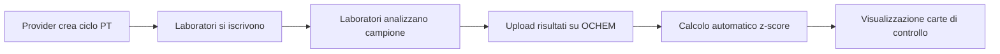

# Cos'e' OCHEM

OCHEM e' una piattaforma web pensata per la gestione dei **Proficiency Testing (PT)**, ovvero le prove valutative interlaboratorio nel settore della chimica ambientale e analitica.

## A cosa serve

Il Proficiency Testing e' un processo in cui piu' laboratori analizzano lo stesso campione e confrontano i propri risultati con un **valore di riferimento (Xpt)**. Questo permette di:

- Verificare la **qualita' analitica** del proprio laboratorio
- Confrontarsi con altri laboratori in modo anonimo
- Individuare eventuali **problemi sistematici** nelle misure
- Soddisfare i requisiti di accreditamento (ISO/IEC 17025)

## Come funziona in pratica

1. Un **provider** (ente organizzatore) crea un **ciclo PT** con parametri da analizzare
2. I **laboratori** partecipanti ricevono un campione da analizzare
3. Ogni laboratorio carica i propri **risultati** sulla piattaforma tramite file CSV
4. OCHEM calcola automaticamente lo **z-score** e altre statistiche
5. I risultati vengono visualizzati in **carte di controllo** per monitorare le prestazioni nel tempo

## Vantaggi

> [!tip] Perche' usare OCHEM
> - **Centralizzato**: tutti i dati PT in un unico posto
> - **Automatico**: calcoli statistici immediati (z-score, sz2, rsz)
> - **Visuale**: grafici interattivi con Plotly
> - **Sicuro**: accesso basato su ruoli per laboratorio
> - **Tracciabile**: audit completo di upload e operazioni

## Vedi anche
- [[A chi si rivolge]]
- [[Requisiti di sistema]]
- [[08-Glossario/Glossario|Glossario]]
