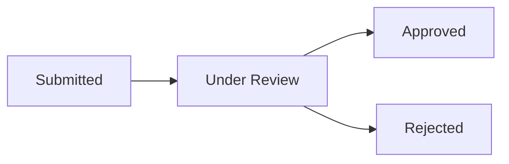

# Registrazione

La registrazione su OCHEM richiede l'**approvazione di un amministratore**. Non e' possibile accedere immediatamente dopo la registrazione.

## Come registrarsi

1. Vai alla pagina di login e clicca su **"Registrati"**
2. Compila il modulo con:
   - **Email**: il tuo indirizzo email professionale
   - **Nome completo**: nome e cognome
   - **Nome laboratorio desiderato**: il nome del laboratorio che vuoi creare (se sei un nuovo laboratorio)
   - **Laboratorio esistente**: oppure seleziona un laboratorio gia' presente (se vuoi unirti)
   - **Ruolo desiderato**: il ruolo che vorresti avere
   - **Note**: eventuali informazioni aggiuntive per l'amministratore
3. Clicca su **"Invia richiesta"**

## Dopo la registrazione

La tua richiesta passera' attraverso questi stati:

| Stato | Significato |
|-------|-------------|
| `submitted` | Richiesta inviata, in attesa di revisione |
| `under_review` | Un amministratore sta valutando la richiesta |
| `approved` | Richiesta approvata - riceverai le credenziali |
| `rejected` | Richiesta rifiutata - contatta l'admin per dettagli |

## Cosa succede quando vieni approvato

- Se hai richiesto un **nuovo laboratorio**: verra' creato automaticamente e tu sarai assegnato come `owner_lab`
- Se hai richiesto di unirti a un **laboratorio esistente**: verrai aggiunto con il ruolo concordato
- Riceverai un **link di attivazione** per impostare la password

> [!info] Requisiti password
> La password deve essere di almeno **10 caratteri**.

## Vedi anche
- [[Login]]
- [[Accettare un invito]]
- [[03-Ruoli/Panoramica ruoli|Panoramica ruoli]]
