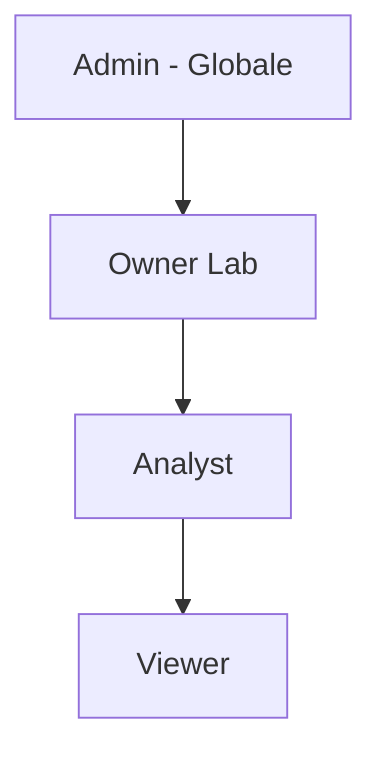

# Panoramica ruoli

OCHEM utilizza un sistema di ruoli a due livelli: **ruoli globali** e **ruoli per laboratorio**.

## Gerarchia

| Ruolo | Livello | Ambito |
|-------|---------|--------|
| [[Ruolo Admin\|Admin]] | 🔴 Massimo | Globale - tutta la piattaforma |
| [[Ruolo Owner Lab\|Owner Lab]] | 🟠 Alto | Per laboratorio |
| [[Ruolo Analyst\|Analyst]] | 🟡 Medio | Per laboratorio |
| [[Ruolo Viewer\|Viewer]] | 🟢 Base | Per laboratorio |

## Ruoli globali vs ruoli lab

- **Ruolo globale (Admin)**: si applica a tutta la piattaforma. Un admin puo' accedere a qualsiasi laboratorio e a tutte le funzioni amministrative.
- **Ruoli lab**: sono specifici per ogni laboratorio. Un utente puo' avere ruoli diversi in laboratori diversi (es. Owner in Lab Alpha e Viewer in Lab Beta).

## Ereditarieta'

I ruoli per laboratorio seguono una **gerarchia**: un ruolo superiore include tutti i permessi dei ruoli inferiori.

- Un **Owner Lab** puo' fare tutto cio' che fa un Analyst e un Viewer
- Un **Analyst** puo' fare tutto cio' che fa un Viewer

## Vedi anche
- [[Ruolo Viewer]]
- [[Ruolo Analyst]]
- [[Ruolo Owner Lab]]
- [[Ruolo Admin]]
