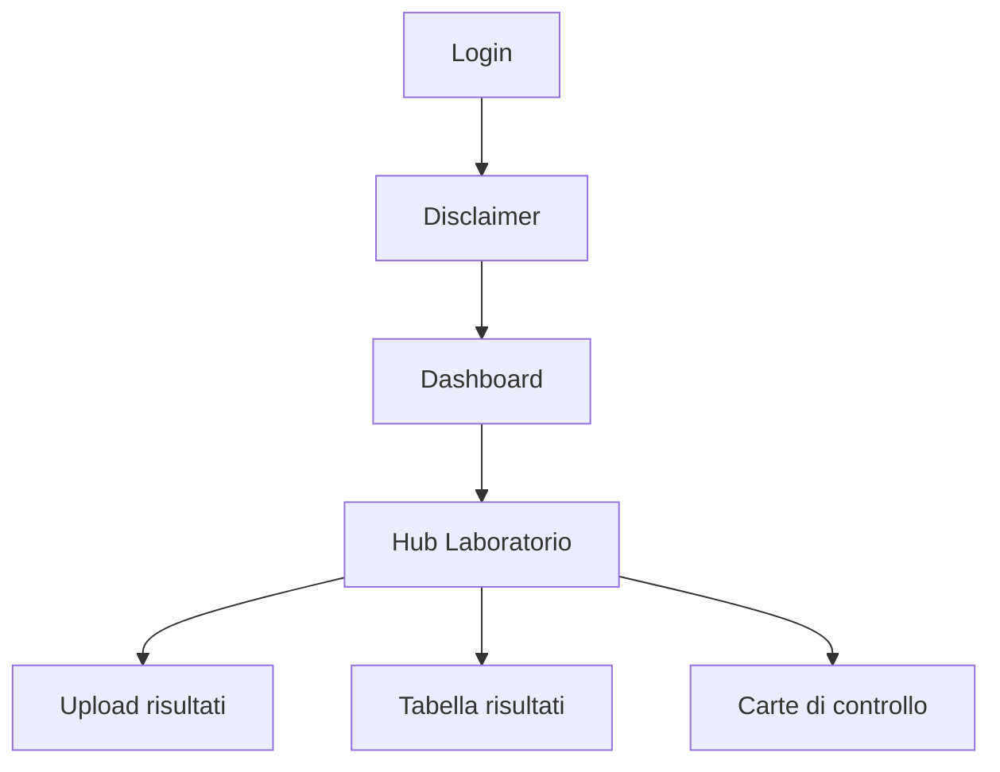

# Navigazione

## Barra di navigazione

La barra superiore contiene:

| Elemento | Descrizione |
|----------|-------------|
| **OCHEM** | Logo/link alla home page |
| **Dashboard** | Torna alla [[Dashboard utente]] |
| **Admin** | Accesso al [[07-Admin/Dashboard admin\|Pannello Admin]] (solo admin) |
| **Logout** | Esci dalla piattaforma |

## Flusso di navigazione tipico

## Percorsi principali

### Per un Analyst
1. Login → Dashboard → Hub Lab → Upload CSV → Tabella risultati → Carte di controllo

### Per un Viewer
1. Login → Dashboard → Hub Lab → Tabella risultati → Carte di controllo

### Per un Admin
1. Login → Dashboard → Pannello Admin → Gestione cicli/utenti/lab

## Vedi anche
- [[Dashboard utente]]
- [[Hub Laboratorio]]
