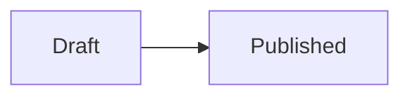

# Stati di un ciclo

Ogni ciclo PT attraversa diversi stati nel suo ciclo di vita.

## Diagramma degli stati

## Dettaglio stati

### Draft (Bozza)
- Il ciclo e' stato creato ma **non e' ancora visibile** ai laboratori
- L'admin puo' modificare parametri, date, documenti
- Non e' possibile caricare risultati

### Published (Pubblicato)
- Il ciclo e' **visibile e attivo** per i laboratori partecipanti
- I laboratori possono scaricare il template CSV e caricare risultati
- I parametri Xpt e sigma PT sono fissati

## Validazioni per la pubblicazione

Un ciclo puo' essere pubblicato solo se:
- Ha almeno un **documento PDF** allegato
- Tutti i parametri hanno **Xpt e sigma PT** definiti

> [!warning] Ciclo senza documenti
> L'amministratore non puo' pubblicare un ciclo se manca il documento PDF di riferimento.

## Vedi anche
- [[Cosa sono i cicli]]
- [[07-Admin/Gestione cicli|Gestione cicli (Admin)]]
